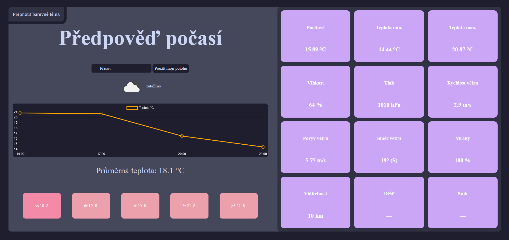

# 🌤️ Weather Forecast

A simple **web application** for displaying a 5-day weather forecast.  
Users can search for a city using the autocomplete input and view the forecast with minimum and maximum temperatures, a temperature chart, and additional weather details.

---

## ✨ Features
- Display of **5-day weather forecast**  
- **City autocomplete** (data from `city.list.json`)  
- Daily details including:
  - minimum and maximum temperature  
  - feels-like temperature  
  - humidity, pressure, wind, cloudiness, precipitation…  
- **Temperature trend chart** throughout the day (Chart.js)  
- Automatic **date and time formatting** according to browser locale  
- **Light/Dark mode** support  

---

## 🛠️ Technologies Used
- **HTML5**, **CSS3**, **JavaScript (ES6+)**  
- **Chart.js** (used only for the temperature chart)  
- Data from **OpenWeatherMap REST API**

---

## 🚀 How to Run
1. Clone the repository:
   ```bash
   git clone https://github.com/Harangus/WeatherForecast.git

## 🔑 API key
This app uses the OpenWeatherMap API
- Register for free at OpenWeatherMap
- Obtain your personal API key
- Replace the value in app.js on line 1
  ```bash
  const API_KEY = 'YOUR_API_KEY';

## 🌍 Supported Browsers
- Google Chrome (latest version)
- Mozila Firefox (latest version)
- Microsoft Edge (latest version)

## 📂 Internal Structure
- Autocomplete Class (app.js)
    - Handles city name autocompletion while typing in the search input
    - Main functions:
        - init() - listens for input changes
        - onInput() - filters the city list based on the user input
        - addSuggestion(city) - adds matching suggestions to the dropdown
    - Comunicates with the main application via the onSelect callback, which triggers data fetching for the selected city
- WeatherApp (app.js)
    - Contains the main weather app logic
    - Main responsibilities:
        - Data fetching: fetchForecast(lan, lon) - retrieves the forecast from OpenWeatherMap and organizes it by day
        - Display a day: showDay(dateKey) - shows the selected day with average temperature, weather icon, and short description
        - Detailed information: showDetails(dp) - displays details like humidity, wind, pressure, etc.
        - Day list rendering: renderDaysList() - generate clickable buttons for the next 5 days
        - Temperature chart: drawcchart(labels, data, icons) - renders a temperature chart using Chart.js
- App Initialization (app.js)
    - Loads the city list (city.list.json), creates instancesof WeatherApp and Autocomplete, and links them so that selecting a city triggers data fetching and updates the display

- ColorModeSwitcher (colorMode.js)
    - Handles switching between light and dark theme modes
    - Main responsibilities:
        - Initialization (init) - checks localStorage for a saved theme. If none is found, it defaults to dark mode
        - Theme toggling - clicking the button switches between light and dark themes by updating the <html> class

## 📸 Preview

